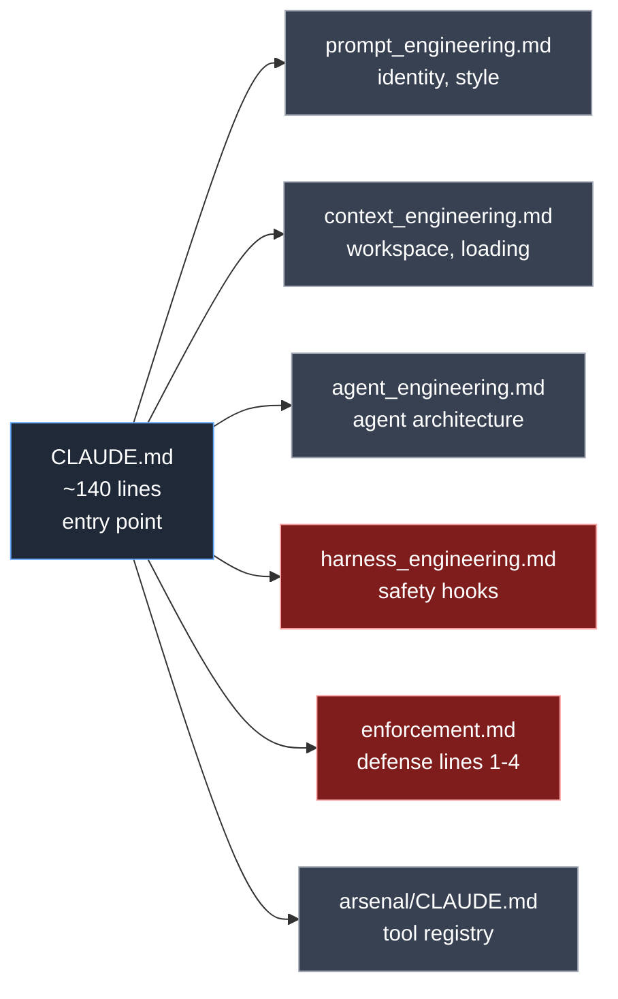
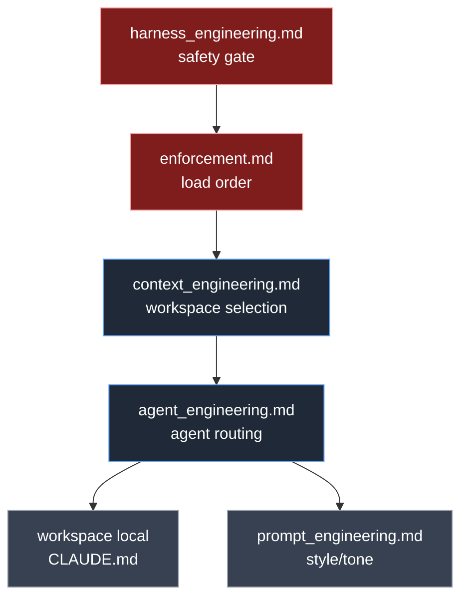

# The Kernel

> **TL;DR** — `CLAUDE.md` is a thin entry file that imports five rule modules and Arsenal's tool registry. Together they define how every model client interprets the system.

This document explains the kernel structure, what each module does, and how the parts compose. After reading this you should be able to read any framework file and understand which module governs it.

---

## Anatomy of the kernel

`CLAUDE.md` itself is short. The substance lives in the modules. The kernel's job is:

1. Declare the system identity (`NAME: Hames`, etc.)
2. Pull in the modules
3. Define top-level routing principles
4. Establish the AI_COMM (model-to-model handoff) scope

All five modules are loaded automatically by Claude Code's `@import` mechanism. Cursor reads them via `.cursor/rules/`. Codex reads them via `AGENTS.md`. Gemini reads them via `~/.gemini/GEMINI.md`. The same content reaches every client.

---

## Module 1 — Prompt Engineering (`prompt_engineering.md`)

**Concern:** how the system speaks and decides task complexity.

Defines:

- **System identity** — `Hames` (COO), `{{CEO_NAME}}` (you, the operator), and the five sub-agent teams (CFO, CSO, CBO, CTO, Marketer)
- **Response style** — `ANTI_FLUFF`, dry, professional. No "I'd be happy to help" preambles.
- **DEEP_TASK_PROTOCOL** — when complexity exceeds a threshold, the system creates a `<Task>_Worklog.md` with sections for plan / discoveries / progress / errors

The complexity rubric is explicit (10-point scale with named criteria). This is intentional: complexity should be a calculation, not a vibe.

---

## Module 2 — Context Engineering (`context_engineering.md`)

**Concern:** which workspace is active and what context to load.

Defines:

- **CURRENT MODE determination** — by comparing `cwd` to a workspace mapping table
- **WORKSPACE MAPPING** — Investment / Business / Company / Hobby (default suggestions; customize freely)
- **FIXED LOAD ORDER** — `[WORKSPACE]/CLAUDE.md` → `[WORKSPACE]/_Master/` → `[WORKSPACE]/_Index.md` → task-specific files
- **Natural-language triggers** — phrases like `<Workspace> 모드로 고정` that select or lock a workspace

The single rule that matters most: **before substantive work, load the workspace map files first**. Random file wandering is the root cause of cross-workspace contamination.

---

## Module 3 — Agent Engineering (`agent_engineering.md`)

**Concern:** how the COO routes and how Level-1 / Level-2 agents compose.

Defines:

- **COO router responsibilities** — interpret task, pick workspace, pick agent team, decide if a model handoff is needed
- **Spawn protocol** — when COO must spawn a Level-1 agent, when COO handles directly, what handoff payload Level-1 needs
- **Two-tier agent architecture** — Level-1 domain agents (CFO, CSO, CBO, CTO, Marketer) each delegate to specialized Level-2 sub-teams
- **AI_COMM rule** — handoff buffer for cross-model continuity, used only on explicit model switch

See `docs/06_agent_architecture.md` for the deep dive.

---

## Module 4 — Harness Engineering (`harness_engineering.md`)

**Concern:** safety, integrity, and what cannot be bypassed.

Defines:

- **DEFINED_CRITICAL_ACTIONS** — `DELETE_FILE`, `OVERWRITE_EXISTING`, `SEND_EMAIL`, `DEPLOY_CODE`, `EXECUTE_SHELL`, `MOVE_FILE` require explicit user approval
- **HARD ENFORCEMENT** — `Write` cannot overwrite existing files; `Edit` must be surgical; `replace_all` is blocked
- **WORKSPACE LOCK** — `/lock <workspace>` activates a PreToolUse hook that blocks writes outside the active workspace
- **NEGATIVE CLAIM VERIFICATION** — when the model concludes "no changes / clean / passed", it must dump raw evidence first

See `docs/05_harness.md` for hook implementation.

---

## Module 5 — Enforcement (`enforcement.md`)

**Concern:** the defense lines that keep the model from skipping the rules.

This is the smallest module by line count and the largest by load-bearing impact. It defines:

- **Defense line 1** — six core rule files must be read end-to-end
- **Defense line 2** — first substantive response must contain a `Loaded:` and `Signatures:` line
- **Defense line 3** — PreToolUse hook reads the transcript and blocks if defense line 2 is missing
- **Defense line 4** — wrapper script pre-injects rule content for headless invocations

See `docs/03_defense_lines.md`.

---

## The Arsenal registry (`arsenal/CLAUDE.md`)

Not a "module" in the rule-engineering sense, but loaded as the sixth core file because it tells the model what tools exist.

Format rule: **filename + invocation only**. No descriptions in the table; if a tool needs explaining, that goes in a separate document. This is intentional — registry files rot quickly when they include prose.

---

## Composition rules

When the modules disagree, the priority is:

1. `harness_engineering.md` wins — the harness is the final gate
2. `enforcement.md` wins over content modules — load order is non-negotiable
3. `context_engineering.md` wins over `agent_engineering.md` — workspace before agent
4. The active workspace's local `CLAUDE.md` overrides the kernel for workspace-scoped concerns (naming, frontmatter)

Higher in the stack = wins on conflict.

---

## What changes when you fork

When you fork Hames for your own use, expect to modify:

- `CLAUDE.md` — your name, your COO persona name (or keep `Hames`)
- `prompt_engineering.md` — response tone, complexity thresholds
- `context_engineering.md` — your workspace list, your trigger phrases
- `arsenal/audit_exclusions.json` — your skip-dirs, your frontmatter requirements

Things you should *not* lightly modify:

- `enforcement.md` — defense lines depend on the exact format
- `harness_engineering.md` — harness rules are coupled to the hook scripts
- `arsenal/compliance_auditor.js` and other hooks — these implement the safety guarantees

---

## Reading order

1. This document (`02_kernel.md`)
2. `03_defense_lines.md` — to understand the load-bearing safety
3. `04_workspace_model.md` — to understand the execution context
4. `05_harness.md` — to understand the hook system in detail
5. `06_agent_architecture.md` — to understand routing and spawn

You can stop after step 3 if your goal is to use Hames. Continue to 4 and 5 if your goal is to modify it.
