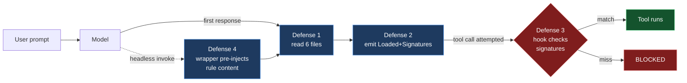
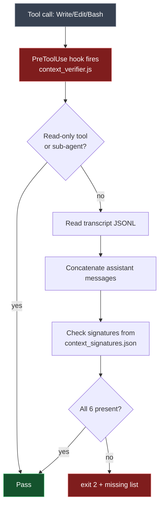

# Defense Lines

> **TL;DR** — Hames does not trust the model to follow rules. Each load-bearing rule has a backstop: text-level instructions, response-level confirmation, hook-level enforcement, and pre-injection at invocation. If any of the first three fail, the next catches it.

This document explains the layered defense system in the order they activate during a session.

---

## The threat model

The threat is not a malicious model. It's a *helpful* model that:

- Skims long rule files instead of reading end-to-end
- Hallucinates a confirmation line because the prompt asked for one
- Treats safety rules as preferences once they conflict with the task
- Behaves correctly with the same prompt one day and incorrectly the next

The four defense lines are designed against these failure modes specifically.



---

## Defense Line 1 — Mandatory full read

**What it does:** instructs the model to read six core files end-to-end before any substantive response.

**Where it lives:** `enforcement.md` section [1].

**The six files:**

1. `CLAUDE.md` (kernel)
2. `.cursor/rules/prompt_engineering.md`
3. `.cursor/rules/context_engineering.md`
4. `.cursor/rules/agent_engineering.md`
5. `.cursor/rules/harness_engineering.md`
6. `arsenal/CLAUDE.md`

**Why six and not one:** modular files are easier to reason about, easier to edit surgically, and a wrong claim in one module is easier to spot. Six is also the threshold below which the model tends to summarize rather than read.

**What this defense does NOT do:** verify that the model actually read them. The next two lines do that.

---

## Defense Line 2 — Confirmation block

**What it does:** requires the model's first substantive response to include exactly two lines:

```
Loaded: CLAUDE.md, prompt_engineering.md, context_engineering.md, agent_engineering.md, harness_engineering.md, arsenal/CLAUDE.md
Signatures: HAMES SYSTEM KERNEL v5.5 | DEEP_TASK_PROTOCOL | FIXED LOAD ORDER | COO ROUTER | DEFINED_CRITICAL_ACTIONS | HAMES ARSENAL — 툴 레지스트리
```

**Where it lives:** `enforcement.md` section [2].

**The Signatures line is the tell.** Each token (`HAMES SYSTEM KERNEL v5.5`, `DEEP_TASK_PROTOCOL`, etc.) is a phrase that *only appears* if the corresponding file was read. Hallucinating one is possible — hallucinating all six in the right order is much less likely.

**Where the line goes:** anywhere in the first substantive response. Defense line 3 searches the whole transcript.

**Failure mode:** model claims the lines but didn't actually read. Defense line 4 (pre-injection) makes this nearly impossible because the content is in the prompt.

---

## Defense Line 3 — PreToolUse hook (infrastructure)

**What it does:** before the model can call `Write`, `Edit`, `MultiEdit`, `NotebookEdit`, or `Bash`, a hook reads the transcript and verifies all six signatures appear. If any are missing, the tool call is blocked.

**Where it lives:** `.claude/hooks/context_verifier.js` + `.claude/context_signatures.json`.

### The implementation



### What's exempt

- **Read-only tools** (Read, Glob, Grep) — never blocked. The model needs to read freely.
- **Sub-agent calls** — when a tool payload contains an `agent_id` field, the check is skipped. The parent's transcript is what matters; the child inherits context through the explicit handoff payload (see `06_agent_architecture.md`).
- **Emergency override** — `touch .claude/.context_verifier_disabled`. Use sparingly.

### What gets logged

Every PreToolUse run logs to `.claude/workspace_audit.log`:

| Result | Meaning |
|---|---|
| `PASS` | All six signatures found |
| `BLOCKED` | At least one signature missing |
| `SKIPPED_SUBAGENT` | Sub-agent invocation, parent's session bears the burden |
| `SKIPPED_DISABLED` | `.context_verifier_disabled` file present |
| `SKIPPED_NO_TRANSCRIPT` | Transcript not yet available (first message) |
| `SKIPPED_NO_CONFIG` | `context_signatures.json` missing — fails open |

The audit log is per-machine (gitignored).

---

## Defense Line 4 — Pre-injection wrapper

**What it does:** for headless model invocations (CLI scripts, automation), defense lines 1–3 may not run because there's no interactive transcript. Defense line 4 pre-injects the six core file contents directly into the prompt.

**Where it lives:** `arsenal/hames_wrap.ps1`.

**Two modes:**

| Mode | Use case |
|---|---|
| **Interactive** (default) | Short pre-instruction (~1.4 KB) telling the model to read the six files and emit signatures. Then the user converses freely. Lines 1–3 do their normal job. |
| **Headless** (`-Headless` flag) | Full file contents (~30 KB) injected into stdin. The model sees the rules verbatim before its first token. One-shot only. |

### When to use which

- **Interactive (most cases):** `hames claude "your prompt"` — opens a regular session with rules pre-loaded as context.
- **Headless (automation):** scheduled jobs, CI scripts, anything where you want a one-shot answer with rules loaded but no follow-up.

The PowerShell `hames` shortcut wraps both: `hames <model> "<prompt>" [-Headless]`.

---

## Composition

The four lines are designed to fail open *only* in their intended cases:

| Failure of... | Caught by |
|---|---|
| Defense Line 1 (model didn't read) | Defense Line 2 (confirmation block missing) |
| Defense Line 2 (model hallucinated lines) | Defense Line 3 (hook re-checks signatures) |
| Defense Line 3 (interactive transcript missing) | Defense Line 4 (rules pre-injected) |
| Defense Line 4 (no wrapper used) | Defense Lines 1+2+3 (interactive path is the default) |

A single defense line is not enough. Three would catch most failures. Four is what gets us to "production-grade for one operator".

---

## Self-output review (an addendum)

After substantive writes — handoff files, rule modules, system docs — the model is required to **re-read its own output** and check it against user intent. This caught past mistakes where the model wrote a handoff that contradicted the actual session state.

Not a separate hook; it's a behavioral rule in `enforcement.md` section [4]. Goes hand-in-hand with the **Negative Claim Verification** rule in `harness_engineering.md` [10].

---

## Failure recovery

When defense line 3 blocks a tool call, the message format is:

```
[HAMES] Defense line 3 blocked tool call.
Reason: missing signature(s): <list>
Action: emit the Signatures line and retry, or read the missing rule file(s).
```

The recovery flow:

1. The model reads the indicated file (one of the six)
2. The model emits the Signatures line in its next response
3. The user re-issues the prompt that triggered the tool call

If you suspect the hook itself is broken (e.g., signature config drifted), use the emergency override and inspect `.claude/workspace_audit.log` to find the actual issue.

---

## Adapting for your fork

If you change the kernel signature line in `enforcement.md`, update `context_signatures.json` to match. The hook compares strings literally — any drift will block all your tool calls.

If you add a seventh core file, update:
1. `enforcement.md` defense line 1 list
2. The Signatures line format in defense line 2
3. `context_signatures.json` with the new signature
4. `CLAUDE.md` `@import` block (so the file actually loads)

These are coupled by design. The coupling makes the system breakable in exactly one obvious way (signatures drift), which is preferable to the alternative (rules silently stop being enforced).
