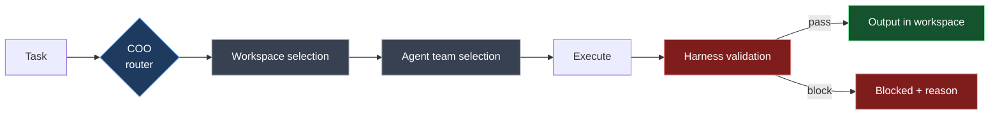
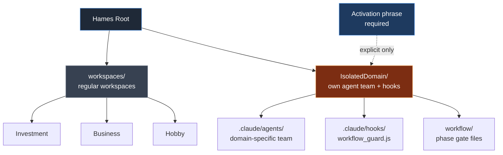

# Workspace Model

> **TL;DR** — A workspace is the execution context. Tasks are routed first to a workspace, then to an agent team. The workspace decides where output goes and what conventions apply. Isolated domains are workspaces with their own agent team and trigger phrase.

This document explains the workspace concept, how routing works, frontmatter rules, and the isolated-domain pattern.

---

## Why workspaces

The problem this solves: in a multi-domain personal AI stack, the model needs a way to know "I am working on Investment right now, not Hobby". Without that anchor:

- Files get written to the wrong directory
- Frontmatter conventions from the wrong domain leak in
- The same prompt produces different file naming on different runs

The workspace is that anchor.

---

## Default workspace mapping

Hames ships with four suggested workspaces:

| MODE | LOCAL_PATH | Example role |
|---|---|---|
| `Investment` | `workspaces/Investment` | financial analysis, asset management |
| `Business` | `workspaces/Business` | personal business, strategy, sales |
| `Company` | `workspaces/Company` | employer / day-job projects |
| `Hobby` | `workspaces/Hobby` | personal creative, learning |

These are **suggestions, not requirements.** The four-workspace taxonomy reflects how the original operator partitions life. Yours might be different — `Research`, `Writing`, `Consulting`, `Teaching`. The system has no opinion as long as the structural rules are followed.

---

## What a workspace contains

```
workspaces/<NAME>/
├── CLAUDE.md         ← workspace-local rules (overrides for the kernel)
├── _Master/          ← anchor docs that are read before substantive work
├── _Index.md         ← file map (optional but recommended)
└── <subprojects>/    ← whatever fits your work
```

The three anchor elements (`CLAUDE.md`, `_Master/`, `_Index.md`) are loaded **in that order** before any substantive file is touched. This is the **FIXED LOAD ORDER** rule from `context_engineering.md`.

The system ships with `workspaces/_scaffold/` as a starting template. Copy it:

```bash
cp -r workspaces/_scaffold workspaces/MyDomain
```

Then edit `workspaces/MyDomain/CLAUDE.md` to define identity and frontmatter rules.

---

## Workspace selection

Workspace selection happens at three levels of explicitness:

| Trigger | Behavior | Lock state |
|---|---|---|
| `cwd` matches a workspace path | Auto-select on first turn | OFF |
| `<Workspace> 모드로` (Korean: "to <Workspace> mode") | Switch active workspace | OFF |
| `<Workspace> 모드로 고정` ("lock to <Workspace> mode") | Advisory lock declared in conversation | OFF (text-only) |
| `/lock <workspace>` slash command | **Real lock** — PreToolUse hook activates | **ON** |

When the lock is **OFF**, the model is on the honor system — it should stay in the active workspace but the harness doesn't enforce it.

When the lock is **ON**, `.claude/hooks/workspace_guard.js` blocks any `Write`/`Edit`/`MultiEdit`/`NotebookEdit` outside the active workspace. SYSTEM_ADMIN paths (`arsenal/`, `.claude/`) remain writable regardless.

To unlock: `/lock <workspace>` again with no name, or message `unlock` / `lock 해제`.

---

## Frontmatter contract

Markdown files inside workspaces are expected to carry frontmatter. The required fields are configured in `arsenal/audit_exclusions.json`:

```json
"frontmatter_blocking": {
  "workspace_prefixes": ["workspaces/"],
  "exempt_workspace_prefixes": [],
  "required_fields": ["Related", "Topic", "Type", "tags"]
}
```

The `verify_frontmatter_block.js` PreToolUse hook checks `Write` operations against this config. Missing required fields → blocked.

To exempt a specific filename (like `README.md`, `_template.md`), add it to `meta_skip_filenames`. To exempt a whole subdirectory, add it to `common_skip_dirs`.

To **disable frontmatter checking entirely** for your fork, set `workspace_prefixes: []`. The hook becomes a no-op.

---

## File naming conventions

Workspace-local CLAUDE.md files typically declare a naming pattern. Default suggestion:

```
{YYYY}-{MM}-{DD}_{Keyword}.md
```

Example: `2026-05-09_Q2_revenue_review.md`

This is enforced by `verify_tasks.js` (PostToolUse hook) when applicable. To customize, modify the workspace's CLAUDE.md and the verifier expectations.

---

## Composition: workspace + agent



The execution unit is **`workspace + Level-1 agent + Level-2 sub-team`**. Examples:

| Combination | Result |
|---|---|
| `Investment + CSO` | `cso_analyst → cso_planner` writes a strategy memo to `workspaces/Investment/` |
| `Business + Marketer` | `marketer_hunter → marketer_executor` writes campaign content to `workspaces/Business/` |
| `Company + CTO` | `cto_architect → cto_coder → cto_reviewer` writes implementation to `workspaces/Company/` |

The workspace sets context, the agent team sets perspective. Same agent + different workspace = different output destination, different conventions, different priorities. Same workspace + different agent = different angle on the same domain.

---

## Isolated domains (advanced)

Some domains need more than a workspace — they need their own agent team, hooks, and explicit trigger phrase. This is the **isolated domain pattern**.



### When to use it

- Domain has a multi-step workflow (e.g., script → render → publish)
- Domain needs phase-gating (cannot skip from step 1 to step 3)
- Domain has a vocabulary that conflicts with main workspaces
- Domain shouldn't be entered casually (you want a deliberate trigger)

### Structure

```
<DomainRoot>/
├── .claude/
│   ├── agents/                  ← domain-specific agent team
│   ├── hooks/<domain>_workflow_guard.js   ← phase gate
│   └── settings.json            ← domain-specific hook config
├── _vendor/                     ← domain dependencies
└── <work directories>/
```

### Trigger contract

The domain has an **activation phrase** (e.g., `<Domain> 모드로 작업 시작`). Without that exact phrase, the kernel does not route into the domain even if the user asks for related work. This is intentional — isolated domains are deliberately not auto-discovered.

### Phase gating

The `<domain>_workflow_guard.js` hook reads phase state from local files (e.g., `workflow/script_approved.json`, `render_approved.json`). If the model attempts a `render` Bash command without the `script_approved` gate file, the hook blocks.

Pattern:

```js
// Pseudocode for <domain>_workflow_guard.js
const phase = detectPhase(toolInput);  // "script" | "render" | "upload"
const gateFile = `workflow/${prevPhase}_approved.json`;
if (phase !== "script" && !fileExists(gateFile)) {
    block(`Phase ${phase} requires ${gateFile}. Approve previous phase first.`);
}
```

### Why this isn't shipped by default

The default Hames installation has no isolated domains. The reasons:

1. They're inherently personal — your domain isn't anyone else's
2. They couple to specific tools (FFmpeg, video pipelines, etc.) that aren't framework concerns
3. The pattern is more valuable than any specific implementation

If you build one, share the structure — not the contents — back to the community.

---

## Common pitfalls

### "My agent keeps writing to the wrong workspace"

Either:
1. Lock isn't ON — turn it on with `/lock <workspace>`
2. The agent definition (`.claude/agents/<role>.md`) overrides workspace context. Check the agent's `OUTPUT` section.

### "Frontmatter validation blocks every write"

Check `arsenal/audit_exclusions.json` `workspace_prefixes`. If your workspace path doesn't match a listed prefix, validation should be a no-op. If it *does* match but you don't want validation, add it to `exempt_workspace_prefixes` or remove from `workspace_prefixes`.

### "I want a workspace but not the agent matrix"

You can use a workspace with only the COO. Skip the Level-1/2 architecture. The framework supports this — agent teams are *available*, not *required*.

### "I want multiple workspaces active at once"

Hames is single-active by design. Switch workspaces explicitly. The lock model does not support OR — only one workspace at a time can be locked.

If you genuinely need parallel workspaces, run two separate AI sessions.

---

## Adapting workspace count

Want fewer than four workspaces? Delete the ones you don't use; the system has no minimum.

Want more? Add them under `workspaces/`. Update `context_engineering.md`'s WORKSPACE MAPPING table and the kernel `CLAUDE.md` if you want them to appear in default routing.

The trigger-phrase parser is in `context_engineering.md` [2]. To add a new workspace name to the natural-language triggers, just add it to the `<Workspace>:` enumeration line.
