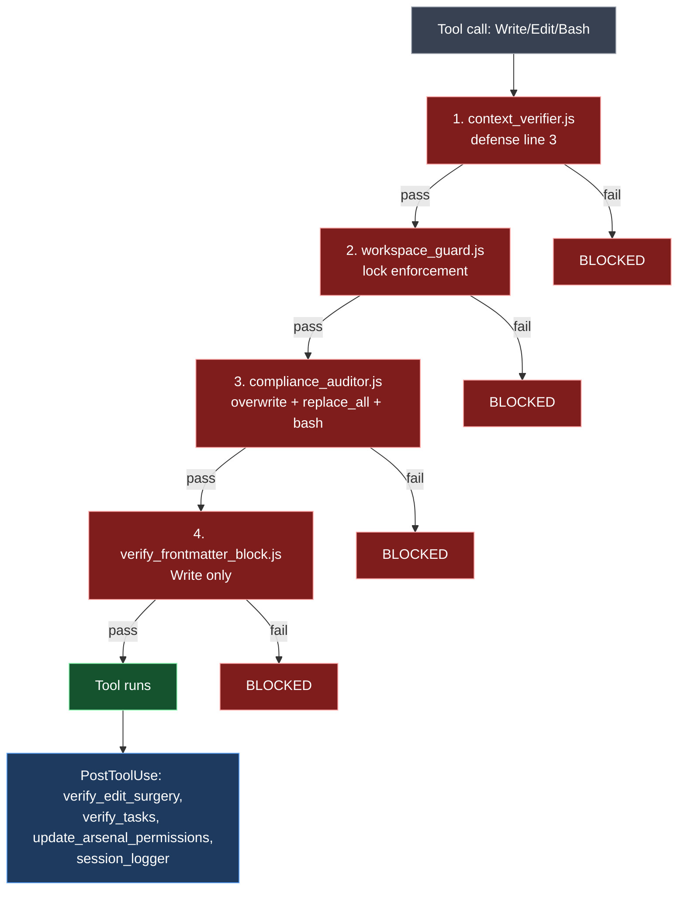

# The Harness

> **TL;DR** — Hames's safety guarantees come from hook scripts, not prompt instructions. This document explains every hook, when it fires, what it blocks, and how to extend or bypass it.

---

## Hook surfaces

Each AI client has its own hook configuration format. Hames mirrors the same logical hooks across all four:

| Client | Surface | Format |
|---|---|---|
| Claude Code | `.claude/settings.json` | JSON |
| Codex CLI | `.codex/config.toml` | TOML |
| Codex App | `.codex/hooks.json` | JSON |
| Gemini CLI | `.gemini/settings.json` | JSON |

The **canonical source** is `.codex/skills/` and `.codex/hooks.json`. `arsenal/sync_skills.ps1` mirrors the canonical to the other surfaces. When you change a hook, change it once at the canonical surface and run sync.

---

## PreToolUse hooks

Hooks that fire **before** a tool runs. If they exit non-zero, the tool call is blocked.

### `context_verifier.js`

**Triggers:** `Write`, `Edit`, `MultiEdit`, `NotebookEdit`, `Bash`

**Job:** verifies defense line 2 signatures appear in the transcript. See `docs/03_defense_lines.md`.

**Skip conditions:**
- Read-only tools (Read, Glob, Grep) — auto-pass
- Sub-agent calls (`agent_id` in payload) — auto-pass
- `.context_verifier_disabled` file present — auto-pass
- Transcript not yet available — auto-pass (first turn)

**Logs to:** `.claude/workspace_audit.log`

### `workspace_guard.js`

**Triggers:** `Write`, `Edit`, `MultiEdit`, `NotebookEdit`, `Bash`

**Job:** when workspace lock is ON, blocks file writes outside the active workspace.

**Logic:**
```
read .claude/.workspace_lock
if lock.locked == false → pass
if path is in SYSTEM_ADMIN paths (arsenal/, .claude/) → pass
if path starts with workspaces/{lock.workspace}/ → pass
otherwise → block
```

**Bash matching is best-effort:** the hook scans the Bash command for absolute paths or write-style patterns (`>`, `tee`, `rm`, etc.) and blocks if they target outside the active workspace. Indirect writes (e.g., a Python script that writes a file) cannot be caught at this layer.

### `compliance_auditor.js`

**Triggers:** `Write`, `Edit`, `Bash`

**Job:** the catch-all safety hook. Blocks:

- `Write` to existing files (use `Edit` instead)
- `Edit` with `replace_all: true` (use surgical edits instead)
- `Edit` where `old_string` covers >X% of the file (configurable threshold; "large rewrites disguised as edits")
- Dangerous Bash patterns: `rm -rf`, `git push --force` to main, `chmod 777`, etc.

**CEO override (Bash only):** include `# CEO:OK` token in the Bash command body. The hook still logs the bypass to `.claude/workspace_audit.log` with `bypass_reason: "CEO:OK_token"`.

**Auto-carveout:** `git rm`, `git mv` are exempt — git history makes them recoverable.

### `verify_frontmatter_block.js`

**Triggers:** `Write`

**Job:** for new markdown files in workspace paths, requires the configured frontmatter fields.

**Configured by:** `arsenal/audit_exclusions.json` → `frontmatter_blocking`

---

## PostToolUse hooks

Hooks that fire **after** a tool succeeds. They can't block the tool but can warn, audit, or trigger downstream actions.

### `verify_edit_surgery.js`

**Triggers:** `Edit`

**Job:** post-hoc check on the edit's surgical-ness. If `old_string` was very large or matched many places, logs a warning. Combined with `compliance_auditor.js`'s pre-check, this catches cases that slipped through the threshold.

### `verify_tasks.js`

**Triggers:** `Write`, `Edit`

**Job:** workspace output validation. If a workspace defines a naming pattern (e.g., `{YYYY}-{MM}-{DD}_{Keyword}.md`), this hook checks the new file name. If the filename is wrong, logs a warning (does not block — the write already happened).

### `update_arsenal_permissions.js`

**Triggers:** `Write`

**Job:** when a new Arsenal tool is added, automatically updates `.claude/settings.json` permissions to allow `node *new_tool.js*` etc. Saves the operator from manually whitelisting.

### `session_logger.js`

**Triggers:** `Write`, `Edit`

**Job:** appends a session log entry to `.session_log.jsonl` (gitignored). For local audit / debugging only.

---

## SessionStart hook

### `session_capture.js`

**Triggers:** session start

**Job:** snapshots the session metadata (cwd, lock state, model, etc.) for audit traceability.

---

## Hook composition

When multiple hooks attach to the same trigger, they run in declaration order in `settings.json`. Any non-zero exit blocks. Order matters because the *first* blocker reports — subsequent hooks don't run.



Cheap checks fire first (signature lookup is faster than file content scanning).

The order ensures cheap checks fire first (signature lookup is faster than file content scanning).

---

## Hook configuration anatomy

Example block from `.claude/settings.json`:

```json
{
  "hooks": {
    "PreToolUse": [
      {
        "matcher": "Write|Edit|MultiEdit|NotebookEdit|Bash",
        "hooks": [
          {
            "type": "command",
            "command": "node \"$CLAUDE_PROJECT_DIR/.claude/hooks/context_verifier.js\"",
            "statusMessage": "Verifying context signatures..."
          }
        ]
      }
    ]
  }
}
```

Key environment variables:
- `$CLAUDE_PROJECT_DIR` — set by Claude Code, points at the repository root
- `$PSScriptRoot` — used in PowerShell hooks, points at the script's directory

Both are preferred over hardcoded absolute paths.

---

## Adding your own hook

1. Write the hook script. It must:
   - Read tool input from stdin (JSON)
   - Exit 0 to pass, 2 to block, 1 for unknown error
   - Log to `.claude/workspace_audit.log` for audit trail

2. Add an entry to `.codex/hooks.json` (canonical):

```json
{
  "matcher": "<tool_pattern>",
  "hooks": [
    { "type": "command", "command": "node \"$CLAUDE_PROJECT_DIR/.claude/hooks/your_hook.js\"" }
  ]
}
```

3. Run `arsenal/sync_skills.ps1` to mirror to the other client surfaces.

4. Verify: trigger the matched tool and confirm your hook fires.

---

## Bypass mechanisms

Three legitimate bypasses exist. Use them sparingly.

### CEO:OK token (Bash only)

Append `# CEO:OK` to a Bash command. Compliance auditor allows the otherwise-blocked command. Audit log records the bypass with the matched pattern.

```bash
rm -rf old_artifact/  # CEO:OK
```

### Emergency disable (defense line 3)

```bash
touch .claude/.context_verifier_disabled
```

Defense line 3 becomes a no-op. **Restore by deleting the file.** This bypass is for debugging hook-related infinite loops; never leave it enabled in normal operation.

### Workspace unlock

```
unlock
```

Or `lock 해제`. Returns workspace_guard to no-op until you `/lock <workspace>` again.

---

## Failure modes

### Hook hangs

A hook that waits for input (e.g., expecting interactive prompt) will hang the entire tool call. Hooks must be **non-interactive**. If you write one, never `Read-Host` or `read` from the terminal.

### Hook crashes with exit 2

This blocks the tool. If you didn't intend to block, your hook has a bug. Run the hook manually with the same input to see the actual error message:

```bash
echo '<tool input json>' | node .claude/hooks/your_hook.js
echo "exit=$?"
```

### Audit log fills up

`.claude/workspace_audit.log` is gitignored but unbounded on disk. Rotate manually:

```bash
mv .claude/workspace_audit.log .claude/workspace_audit.log.$(date +%Y%m%d)
```

There is no auto-rotation by design — it's a debug log, not production telemetry.

---

## Why this design

Hooks are not an exotic concept — every CI system uses them. The novel claim Hames makes is that **safety rules for AI work need the same enforcement guarantees as safety rules for code work**. Saying "don't `rm -rf`" in a prompt is the equivalent of saying "don't introduce regressions" in a CONTRIBUTING file. Both are necessary. Neither is sufficient.

The harness is what makes the rules reliable. Without it, this is just another set of nice prompts.
