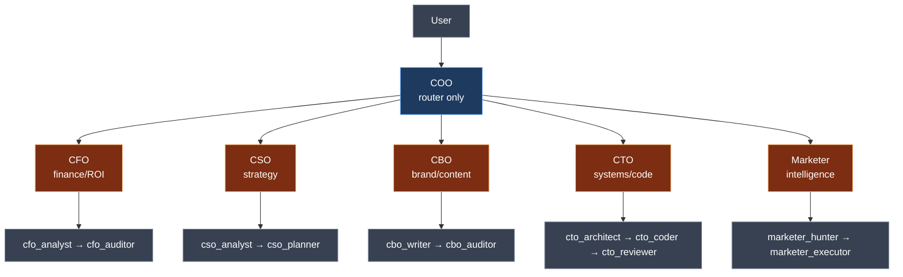
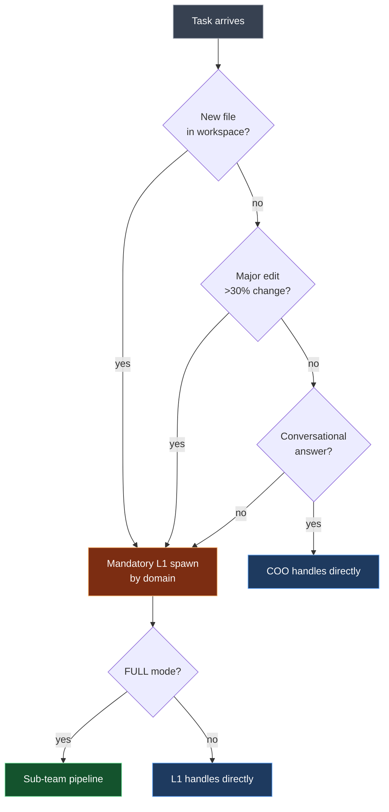
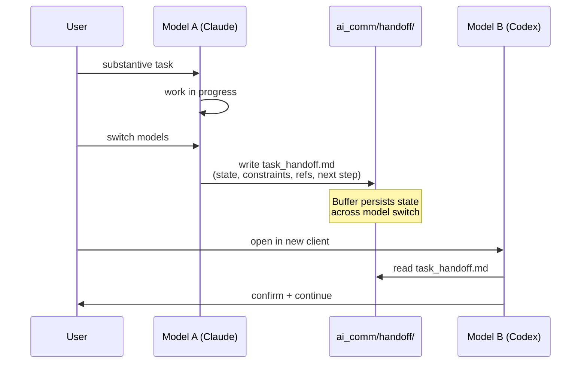

# Agent Architecture

> **TL;DR** — The COO routes; Level-1 agents specialize by domain; Level-2 sub-teams pipeline the work. AI_COMM is the buffer for cross-model handoff. This document explains how the pieces fit and when each one activates.

---

## The shape



---

## Level 1 — The COO router

**Identity:** "Hames" (the system's COO persona). Distinct from any specific Claude / GPT / Gemini instance.

**Responsibilities:**

1. **Interpret the task** — what is actually being asked
2. **Determine the workspace** — by `cwd`, lock state, or explicit user trigger
3. **Pick the agent team** — based on domain (financial → CFO, content → CBO, etc.)
4. **Decide if a model handoff is needed** — sometimes the right tool is a different model entirely
5. **Keep the task aligned with workspace rules** — naming, frontmatter, output destination

The COO does **not** execute the task in most cases. Exception: short conversational answers, status checks, simple lookups. For substantive work (file creation, multi-step analysis), the COO spawns Level-1.

### Spawn protocol



The decision rule:

| Situation | Action |
|---|---|
| Substantive new file in a workspace | **Mandatory Level-1 spawn** for the matching domain |
| Major edit to existing file (>30% change or new section) | **Mandatory Level-1 spawn** |
| Conversational answer (no file involved) | COO handles directly |

When COO spawns Level-1, the handoff payload is explicit:

**Mandatory fields:**
- `active workspace` + full output file path
- task summary (one paragraph)
- workspace frontmatter spec (naming, required fields)
- `_Master/` core facts (3–5 line summary)
- CEO constraints from the conversation (budget, deadline, tone)
- mode: `FULL` (use sub-team pipeline) or `LITE` (direct)

**Conditional fields (when applicable):**
- already-rejected directions
- relevant files COO has loaded
- domain-specific context (e.g., for CFO: budget ceiling; for CTO: reusable Arsenal tools)

**Not included:** kernel rules, rule modules, harness hooks. Sub-agents auto-load these from the same `cwd`.

---

## Level 2 — Domain agents

Each Level-1 agent has a specialized sub-team. The pipelines are defined in each Level-1 agent's `TEAM ORCHESTRATION` section.

### CFO — finance, ROI, risk

```
cfo_analyst   → cfo_auditor
(numbers)       (judgment + VETO)
```

**Use cases:** ROI calculation, budget verification, financial risk evaluation, KPI audit.

The auditor is the gate — it can VETO the analyst's output if the numbers don't pass risk thresholds.

### CSO — strategy, leverage, bottleneck

```
cso_analyst   → cso_planner
(diagnose)      (roadmap)
```

**Use cases:** strategy formulation, leverage analysis, competitive positioning, bottleneck identification, long-term roadmap.

### CBO — brand, content, narrative

```
cbo_writer    → cbo_auditor
(draft)         (consistency check + VETO)
```

**Use cases:** brand voice, copywriting, narrative design, content quality audit.

### CTO — systems, code, implementation

```
cto_architect → cto_coder → cto_reviewer
(spec)          (impl)       (review + VETO)
```

**Use cases:** system architecture, script implementation, pipeline design, technical feasibility, code review.

The three-stage pipeline is the most rigorous because code is the most consequential to ship wrong.

### Marketer — market intelligence, execution

```
marketer_hunter   → marketer_executor
(gather data)       (turn into deliverable)
```

**Use cases:** competitor research, trend analysis, content production from intel, campaign drafts.

External validation (Perplexity, web search) is encouraged for `Marketer` because the work depends on real-world current state.

---

## Orchestration rules

1. **COO spawns Level 1.** Never Level 2 directly.
2. **Level 1 spawns Level 2** in FULL mode. In LITE mode, Level 1 handles directly.
3. **Auditor VETO.** When Level-2 has a `_auditor` step, it can return REJECT to its Level-1 parent. The parent re-spawns the writer/coder with the rejection feedback. Two REJECT cycles = escalate to user.
4. **No auto-VETO across teams.** A CFO veto cannot block a CBO output. Level-2 VETO is intra-team only.

---

## AI_COMM — the model handoff buffer

When you switch models (Claude → Codex, Codex → Gemini), there is a continuity problem: the new model has none of the conversation context.

AI_COMM is a per-task handoff document the *previous* model writes for the *next* model.

### Contents

```yaml
task_summary: <one paragraph>
current_state: <what's done, what's pending>
constraints: <hard requirements from user>
referenced_files: [<list of paths the next model should read>]
workspace_map_pointers: <CLAUDE.md, _Master/, _Index.md paths>
open_questions: [<things needing user input>]
next_step: <recommended first action for next model>
```

### When to use it

Only on **explicit model switch**. Routine tasks within a single model do not need AI_COMM.

### What it is NOT

- Not the main workspace
- Not an executor (it doesn't run anything)
- Not an authority on workspace rules
- Not a high-privilege orchestration hub

It is **a buffer**. Treat it as such.

### Handoff workflow



The `/handoff` slash command automates step 1 with a canonical document structure. `/close-handoff` archives completed handoffs.

---

## Git execution model

Hames does **not** require branch-per-task or worktree-per-task. The kernel is agnostic about your git workflow.

If you prefer single-branch:

- Stay on `main` (or your equivalent)
- Make small intentional commits
- Trace through commit messages and workspace artifacts

If you prefer worktrees:

- Use them
- Hames doesn't care

Sub-agent calls in particular do not need their own branches — sub-agents are conversational entities, not git entities.

---

## External validation

Some agent calls should reach beyond the model:

- **Marketer** — should use external validation when the task depends on live market facts
- **CFO / CSO** — may invoke external validation for high-stakes assumptions
- **CTO** — only when the task involves a library/API the model might be wrong about (use Context7 or similar doc fetch)

The system has a `/search` command (Perplexity-backed) that any agent can invoke. There is also a `redteam` and `extract` mode for OpenAI Specialist (`arsenal/openai_specialist.py`) — use selectively.

External validation is not free (latency, cost). The decision to validate is a Level-1 agent decision, not a default.

---

## When to add a new agent

You probably don't need to. The five Level-1 agents (CFO, CSO, CBO, CTO, Marketer) cover the substantive domains for personal AI work. Adding more usually means:

- Splitting a domain that should stay unified (e.g., adding "HR" when "CSO" already covers strategy)
- Creating a vanity role with no real workflow (e.g., "Visionary")
- Mistaking *task type* for *domain* (e.g., "Documenter" — that's not a domain, it's a delivery format)

Legitimate reasons to add an agent:

- Genuinely new domain that none of the five owns (e.g., "Therapist" for a mental-health journal workspace)
- A repeated workflow that needs its own auditor

When you add: define `agents/<name>.md` and (if FULL mode) `agents/<name>_<role>.md` for sub-team members. Update `agent_engineering.md`'s domain routing table. Update `arsenal/CLAUDE.md` if the agent introduces new tools.

---

## Failure modes

### "The COO writes the file directly instead of spawning"

The spawn protocol is in `agent_engineering.md` [2.7]. If COO is bypassing it, either:
1. The task didn't trigger spawn (it's conversational)
2. The COO is skipping in LITE mode where it shouldn't be

Check: re-read the spawn rule and verify the task category.

### "Sub-agents don't know about the workspace"

The handoff payload from COO must include the active workspace and output path. If those are missing, the sub-agent has no anchor. Check the spawn message.

### "Model handoff loses context"

The handoff file is incomplete. Required fields (see AI_COMM section above) are not optional. The previous model has to populate all of them.

### "Two agent teams disagree"

That's not a failure — that's the system working. Cross-team disagreement is rare; when it happens, the COO is the tiebreaker. Ultimately the user decides, but the COO presents the choice.

---

## Reading order from here

You've finished the docs sequence. Recommended further reading:

- **`INSTALL.md`** — if you haven't installed yet
- **The kernel itself** — `CLAUDE.md` and the five rule modules. They're the source of truth; everything in `docs/` is explanatory.
- **The hooks** — `.claude/hooks/*.js` and `arsenal/*.js`. Read the implementation to fully internalize the harness.

Welcome to Hames.
